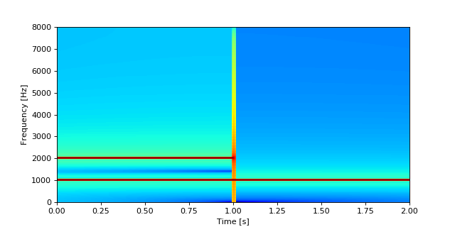
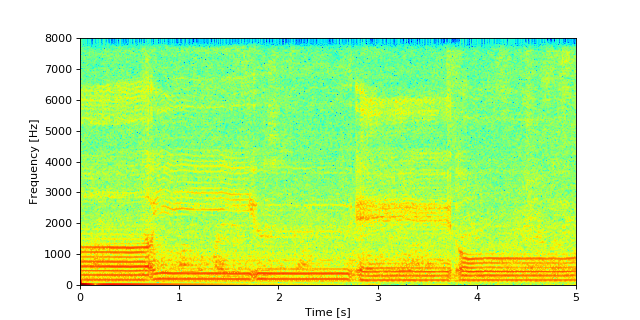

# sound_processing

色々音声ファイルを処理してグラフできれいに表示する．

### スペクトログラムを表示する

スペクトログラム(音声信号を窓関数に通して周波数スペクトルを計算したもの)を表示する．

`programfiles/mylibrary.py`の`make_spct()`に主に実装されているので

```sh
python3 ./programfiles/prc2-3.py
```

と実行すれば任意のファイルからスペクトログラムを表示可能．

試しに

```python
f1 = 1000
f2 = 2000
fs = 16000
t = 2
a = 10000
x = np.linspace(0, t, num=t*fs)
y1 = a * np.sin(2 * np.pi * f1 * x)
y2 = np.zeros(len(x))
y2_ = a * np.sin(2 * np.pi * f2 * x[:len(x)//2])
y2[:len(y2_)] = y2_
y = y1 + y2
```

といった信号`y`を`make_spct()`に通してみると下のようになる．



ちゃんと1000Hzと2000Hz部分が赤くなっていることが分かる．

普通に"あいうえお"と言った声を録音したファイルを入力すると以下のようになる．



周波数成分が時間によって変化することが確認できる．